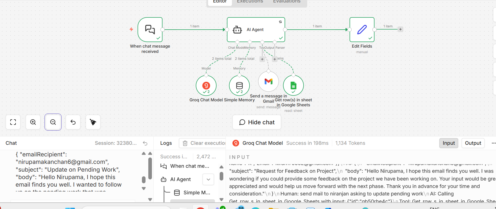

# smart-mail-automation-bot
 
An AI-powered email automation workflow built using n8n that sends emails by fetching recipient details from Google Sheets using simple chat commands
 
Overview
 
This agentic AI bot allows users to send emails without manually entering email addresses.
With a simple command like:
 
"Send email to Kiran"
 
the system:
 
- extracts the name
- finds the email in Google Sheets
- sends the email via Gmail
 
---
 
Tech Stack
 
- n8n
- Google Sheets
- Gmail
- AI (LLM for name extraction)
 
---
 
Workflow
 
1. User sends a message
2. AI extracts the name
3. Google Sheets retrieves the email
4. Gmail sends the email
 
---
 
Features
 
- Simple and automated email sending
- Dynamic email lookup
- Clean and scalable workflow
 
---
 
Usage
 
1. Import the workflow into n8n
2. Connect Google Sheets and Gmail
3. Run the workflow
4. Send a message like:
   "Send email to Ravi"
 
---
 
Author
 
Nirupama S

 
